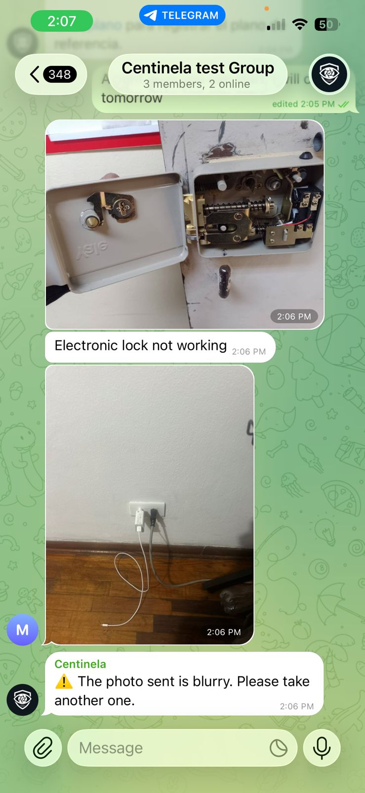

# Centinela

> **🤖 Try the live bot:** [**@C3nt1nel_bot on Telegram**](https://t.me/C3nt1nel_bot) — for the full experience, **add the bot to a group chat** (Centinela is designed for technician crews collaborating in a per-site group, not 1:1 DMs). Once added, an authorized admin runs `/iniciar <project_name>` to start an inspection session.



Telegram bot + multimodal AI agent that turns field photos and chat messages from electronic security maintenance crews into structured inspection reports for retail clients (Cencosud, Metro). MVP built for the AMD Developer Hackathon.

## Business Justification

Maintenance contractors for retail security systems (CCTV, fire alarms) in Peru cannot invoice their work until they deliver a formal technical report with visual evidence per device, per location. Today an assistant spends **12+ hours per local** manually collecting photos from messy WhatsApp/Telegram groups, pairing "during/after" evidence and writing observations.

**Centinela** acts as an intelligent observer inside the existing per-local Telegram group: it ingests photos and messages in real time, deduplicates and classifies them with a multimodal LLM (Gemma served via vLLM on AMD MI300X), and on `/finalizar_proyecto` produces the consolidated maintenance report. Target: reduce human review time from 12+ hours to **under 15 minutes per local**.

## Current Infrastructure and Services Deployed

| Component | Detail |
|---|---|
| LLM inference | **vLLM nightly (v0.20.2rc1, ROCm)** serving `google/gemma-4-31B-it` on a DigitalOcean **AMD Instinct MI300X (192 GB)** GPU droplet (`134.199.206.109`). OpenAI-compatible API on port 8000. |
| Bot transport | Telegram Bot API (long polling). Bot: `@C3nt1nel_bot`. |
| Persistence | SQLite local file (metadata only — **no image binaries are stored**; Telegram CDN is the source of truth via `file_id`). |
| Runtime | Python 3.13.0 (`pyenv` + `venv`), dependencies pinned in `requirements.txt`. |
| Container images | `vllm/vllm-openai-rocm:nightly` (GPU droplet), `Containerfile.bot` (bot — see `containers/`). Built and run with **Docker 29.3.0** on the droplet. |

> Detailed product/engineering spec: [docs/artifacts/in/product_def.md](docs/artifacts/in/product_def.md)

## Steps to Create the Infrastructure and Resources

### Prerequisites

- A **DigitalOcean AMD GPU droplet** (Instinct MI300X) with SSH access.
- A **Telegram bot** created via `@BotFather` (HTTP API token).
- `.env` file populated from `.env.example` with real values (bot token, droplet IP, SSH key path, HF token, etc.).

### 1. Start vLLM on the GPU droplet

```bash
bash scripts/start_vllm.sh
bash scripts/check_vllm.sh   # wait until /v1/models returns the model
```

### 2. Deploy the bot container to the droplet

```bash
bash scripts/deploy-bot.sh
```

This script archives the repo, uploads it to the droplet via SCP, builds the Docker image remotely, and starts the `centinela-bot` container (Telegram long-polling, no public port).

### 3. Deploy the demo API container to the droplet

```bash
bash scripts/deploy-demo.sh
```

Builds the same image, starts the `centinela-demo` container (Flask API exposed on the port configured in `DEMO_PORT`), and opens the corresponding UFW rule.

### 4. Verify

```bash
# Check both containers are running
source .env && ssh -i "$DROPLET_SSH_PRV_KEY_PATH" root@"$DROPLET_IP" "docker ps"

# Tail bot logs
source .env && ssh -i "$DROPLET_SSH_PRV_KEY_PATH" root@"$DROPLET_IP" "docker logs -f centinela-bot"
```

## Architecture (Summary)

Hexagonal (Ports & Adapters), no vertical slicing yet:

```
src/
├── app/   # domain, ports, services (framework-agnostic)
└── ext/   # repositories, providers, controllers, shared infra
```

Full conventions and rules: [AGENTS.md](AGENTS.md).

## Shortcomings

- **No image persistence**: by design, lost messages from Telegram cannot be reprocessed once their `file_id` expires on Telegram's CDN.
- **SQLite single-file storage**: fine for the MVP, will not scale to multiple concurrent locales without migration to a server DB.
- **Long polling only**: no webhook deployment yet; not production-grade for high message rates.
- **Auth & multi-tenant**: a single bot serves all locales identified by `chat_id`; no per-tenant isolation beyond that.
- **vLLM nightly dependency**: Gemma 4 requires vLLM nightly (>= v0.20.x) because the stable v0.17.1 does not recognise the `gemma4` architecture. Alternatives: SGLang, HF Inference Providers.
- **Bot containerised on droplet**: deployed to the AMD GPU droplet via `scripts/deploy-bot.sh` (Docker 29.3.0). Run `bash scripts/deploy-bot.sh` from a local machine with `.env` populated; the script archives tracked files, SCPs the archive to the droplet, builds the image remotely, and starts/restarts the container.

## Repository Structure

```text
.
├── AGENTS.md                          # Instructions for AI agents (Copilot, etc.)
├── README.md                          # This file
├── requirements.txt                   # Pinned Python dependencies (TBD)
├── config.py                          # Loads .env, exposes typed config (TBD)
├── containers/
│   └── Containerfile.bot               # OCI image for the Telegram bot
├── scripts/                           # start/stop/check vLLM helpers
├── src/
│   ├── app/                           # Domain, ports, services
│   └── ext/                           # Adapters: Telegram, vLLM, SQLite, controllers
└── docs/
    ├── index.md                       # Documentation entry point and logbook index
    ├── status.md                      # Current execution state
    ├── logbooks/                      # Daily logbook entries
    │   └── YYYY-MM-DD.md
    └── artifacts/
        ├── in/                        # External input files (e.g. product_def.md)
        └── out/                       # Output files co-created with AI agents
```

## Documentation

| File / Folder | Description |
|---|---|
| [docs/index.md](docs/index.md) | Documentation entry point with links to status, artifacts, and logbook entries |
| [docs/status.md](docs/status.md) | Current execution state: completed tasks, pending items, risks, and next milestone |
| [docs/logbooks/](docs/logbooks/) | Chronological logbook entries with technical details, decisions, and findings |
| [docs/artifacts/in/](docs/artifacts/in/) | External input files such as the product/engineering spec |
| [docs/artifacts/out/](docs/artifacts/out/) | Output files co-created with AI agents |
